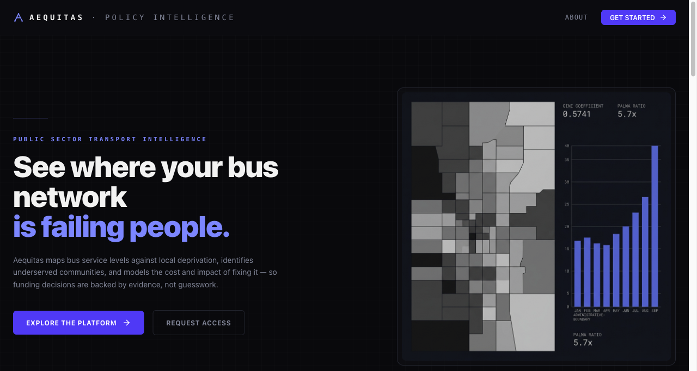

# Aequitas

<div align="center">

**Open transport equity intelligence for governments, researchers, and civic technologists.**

*Which communities are underserved — by how much — and what would it cost to fix?*

[](https://github.com/SVamseekar/aequitas/stargazers)
[](https://github.com/SVamseekar/aequitas/network/members)
[](https://www.python.org/)
[](https://fastapi.tiangolo.com/)
[](https://react.dev/)
[](https://duckdb.org/)
[](LICENSE)



</div>

---

## The problem

Transport authorities everywhere have the same problem: mountains of open data — stop locations, timetables, deprivation indices, route geometries — spread across incompatible formats, and no fast path from raw data to the question that actually matters: **which communities are underserved, and by how much?**

That question still gets answered with spreadsheets and gut feel in most cities and regions around the world. Aequitas gives you a rigorous, auditable answer — complete with formula traces, plain-English narratives, and a policy scenario sandbox — in a dashboard anyone can use without a data science team.

> **Want to use or adapt this for your region?** Reach out first — martisoura@gmail.com

---

## What it produces

| Module | Output |
|---|---|
| **Equity** | Gini coefficient, Lorenz curve, Palma ratio, concentration index, triple-deprivation flags |
| **Accessibility** | 2SFCA catchments, 400m stop coverage, job/healthcare/education access gaps |
| **Service quality** | Headway, evening isolation, Sunday deserts, peak ratios, weekend penalty |
| **Route network** | Geometry, HHI operator concentration, route clustering by archetype |
| **Economic appraisal** | Benefit-cost ratios via standard transport appraisal methodology |
| **Carbon & modal shift** | Elasticity-based modal shift scenarios, national carbon reduction factors |
| **Policy scenarios** | Frequency restoration, last-bus extension, DRT — projected population impact and cost |
| **Market structure** | Franchising readiness and operator concentration tiers by region |

Every metric ships with a plain-English narrative and a documented formula trace back to the source data.

---

## What the data shows — England reference implementation

> Numbers from the pre-computed warehouse covering all 33,755 lower-layer super output areas in England.

- **Gini 0.57** — bus service is more unequally distributed than household income (income Gini: 0.36)
- **Palma 5.7** — the best-served 10% of areas receive 5.7× more service than the bottom 40%
- **Concentration index +0.14** — service provision is systematically pro-rich
- **6,776 areas** have zero accessible services within a 400m walk of any bus stop
- **53–72% of service variance** is explained by policy choices, not demographics — the gap is a decision, not a inevitability

The same methodology applies anywhere. The numbers change; the analytical framework does not.

---

## Architecture

```
Open data sources
    └──► Ingestion       GTFS · census boundaries · deprivation index · points of interest
         └──► Processing  Deduplication · spatial joins · service quality aggregation
              └──► Analytics  Equity · accessibility · ML clustering · economic appraisal
                   └──► DuckDB warehouse  ◄── read-only at runtime
                        └──► FastAPI backend
                             ├──► React dashboard
                             └──► RAG chatbot  (FAISS retrieval + Gemini Flash)
```

**Design principles**
- All analytics are pre-computed at build time — the runtime API is a read-only lookup, zero live computation during a user session
- Narratives are generated by deterministic, evidence-gated rules — suppressed when evidence is weak, never fabricated
- The chatbot is grounded in the warehouse; it cannot return a number that isn't in the pre-computed data

### Stack

| Layer | Technology |
|---|---|
| Frontend | React 18, Vite, TypeScript, Tailwind CSS, shadcn/ui, Mapbox GL |
| Backend | FastAPI (Python 3.12+) |
| Warehouse | DuckDB (single pre-built binary, served read-only) |
| Intermediate data | Parquet |
| Chatbot | Gemini Flash + FAISS + all-MiniLM-L6-v2 embeddings |
| Auth & persistence | Supabase |

---

## Who it's for

**Transport authorities and local government** — build the evidence base for funding bids, route reviews, and franchising decisions without needing an in-house data science team.

**National ministries and regulators** — benchmark equity performance across regions, run what-if policy scenarios, and produce audit-ready outputs for committees and consultations.

**Researchers and academics** — fully reproducible, open methodology; every metric is documented to formula level with source data citations and a ground-truth validation suite.

**Civic technologists and open data practitioners** — fork the repo, swap the ingestion layer for your country's data sources, and keep the analytics pipeline and dashboard unchanged.

---

## Running it for your country

The pipeline is built around a country-agnostic data model. The only layer that changes between countries is ingestion.

| Data type | England source | Standard equivalent |
|---|---|---|
| Transit timetables | BODS | Any GTFS feed |
| Stop locations | NaPTAN | GTFS `stops.txt` |
| Deprivation index | IMD | SEIFA (AU) · NZDep (NZ) · ACS (US) · EU-SILC (EU) · national equivalents |
| Small-area boundaries | ONS LSOA | SA1 (AU) · Meshblock (NZ) · Census Tract (US) · LAU (EU) |
| Points of interest | GIAS / NHS ODS | National open datasets |
| Population | ONS Census | Any national census |

Write a new ingestion module. The processing, analytics, warehouse schema, and frontend need no changes.

---

## Getting started

**Prerequisites:** Python 3.12+, Node 18+, [`uv`](https://docs.astral.sh/uv/), a Supabase project, a Gemini API key.

### Backend

```bash
git clone https://github.com/SVamseekar/aequitas.git
cd aequitas

uv sync
uv run aequitas build        # ingest → process → analyse → build DuckDB warehouse
uv run uvicorn aequitas.api.app:app --reload
```

### Frontend

```bash
cd frontend
npm install
npm run dev
```

Dashboard connects to `http://localhost:8000` by default. See `frontend/src/api/client.ts` to configure a different API host.

---

## Get in touch

If you're a transport authority, ministry, research institution, or civic tech organisation and want to deploy or adapt Aequitas — **reach out before you start**. I can help assess data availability for your country, scope the adaptation work, and flag the gotchas from the England build.

**Marti Soura Vamseekar** · martisoura@gmail.com

Good reasons to reach out:
- Adapting Aequitas to a new country or transit network
- Research collaboration or co-authorship
- Institutional partnerships or grant-funded deployments
- Custom analytics modules, additional policy scenarios, or bespoke appraisal methodologies

Bug reports and feature requests: [open an issue](https://github.com/SVamseekar/aequitas/issues)
