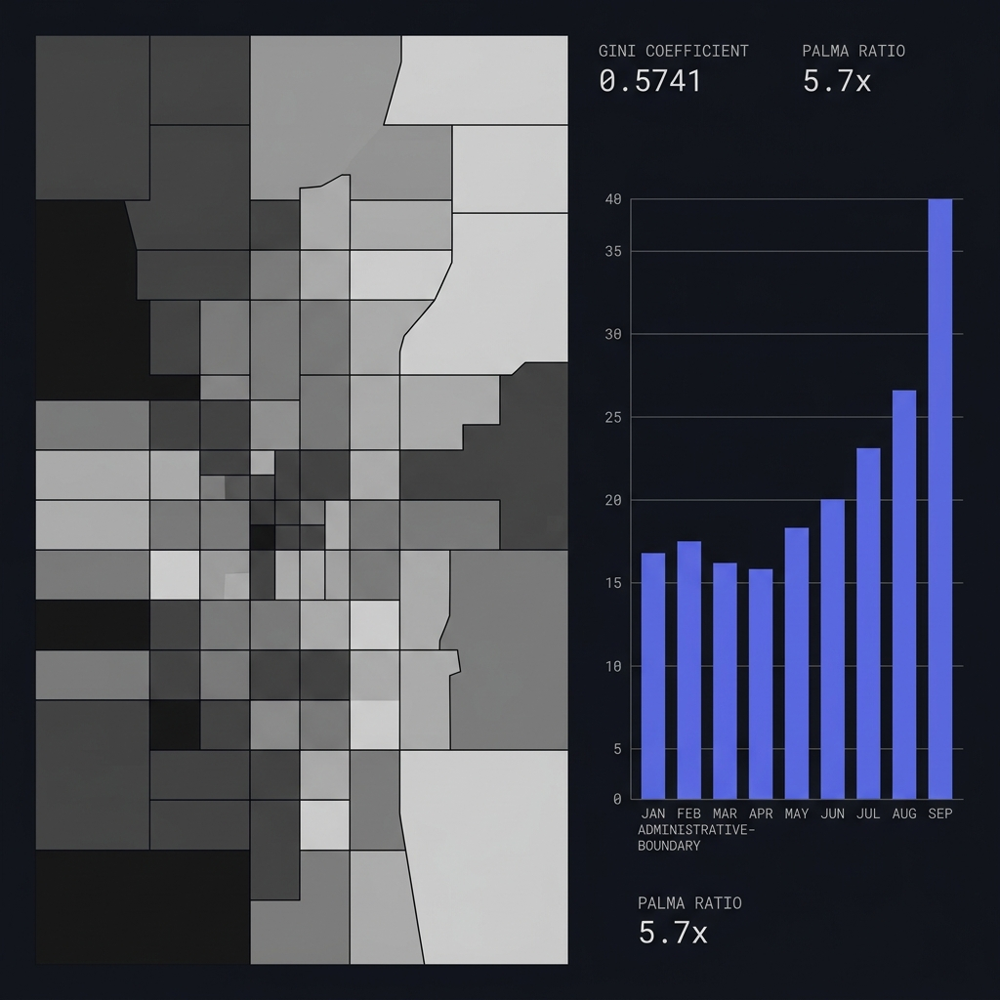

# Aequitas

**See where the bus fails people.**

Open timetables joined to official deprivation — same method in England, Ireland, and the Netherlands. France uses the same doors; the pack is not built yet. No licence fee. Ranks stay **inside each country**.

[](https://www.python.org/)
[](https://fastapi.tiangolo.com/)
[](https://react.dev/)
[](https://duckdb.org/)

<p align="center">
  
</p>

Marketing site: [aequitas.souravamseekar.com](https://aequitas.souravamseekar.com)  
App (local warehouse): [localhost:5173/app/england](http://localhost:5173/app/england)

---

## Why it exists

Authorities already publish GTFS, census geographies, and a national deprivation index. What they rarely have is a **briefing**: one score, a map, and exhibits that answer the same questions in every region — without a proprietary accessibility engine or a per-seat licence.

Aequitas is that briefing. It is not a SaaS clone of Remix or TRACC. It does not invent travel times, euro BCRs, or a Europe-wide deprivation index.

---

## Coverage

| | Network | Deprivation | Geography | App |
|---|---|---|---|---|
| **England** | BODS GTFS + NaPTAN | IMD 2025 | LSOA 2021 | Live |
| **Ireland** | TFI `GTFS_All.zip` | Pobal HP 2022 | CSO Small Areas 2022 (Republic) | Live |
| **Netherlands** | [OVapi](https://gtfs.ovapi.nl/) | CBS SES-WOA 2023 | Buurten 2024 | Live — **bus** default; `?mode=all` adds rail, tram, metro |
| **France** | NAP GTFS (planned) | F-EDI or Filosofi proxy | IRIS | Pack not built |

Never plot IMD, HP, SES-WOA, and F-EDI on one axis.

**In-country score** (0–100), one function:

`100 × (0.40 × people within 400 m + 0.25 × evening served + 0.20 × weekday quality + 0.15 × (1 − |deprivation–service r|))`

Missing terms are dropped and the weights renormalised. London rural is empty (no rural LSOAs). Netherlands scores use SES–service, not IMD.

---

## What you get

| Door | What it answers |
|---|---|
| **Home** | Map + quoteable score for the active filter |
| **Equity** | Lorenz, Gini, Palma, deprivation-decile slope — in-country only |
| **Access** | 400 m coverage, deserts, urban–rural gap |
| **Service** | Weekday quality, evening isolation, Sunday deserts |
| **Network** | One operator HHI on a **0–10,000** scale |
| **Correlations** | One matrix + one scatter (not a wall of bars) |
| **Economy** | People-gap; official € / TAG only where a free unit cost exists |
| **Policy** | BSA 2025 (England) · National policy / NTA (Ireland) · Concession / OV-wet (Netherlands) |
| **Scenarios** | Listed interventions × people × deprivation |
| **Time** | The same metric across **network** dates. Census and deprivation stay frozen. |
| **Reach** | Aequitas service bands 1–6. 15 / 30 / 45 minute jobs only after a local r5py run |
| **Studio** | Walk-to-stop patch on the live filter. Labelled as such — not 45-minute jobs |
| **Compare** | Two regions **inside** the same country |

Chat retrieves from a **country** index (England and Ireland). The Netherlands drawer says the index is not built. It does not invent numbers.

---

## Quick start

You need Python 3.12+, Node 18+, and [`uv`](https://docs.astral.sh/uv/). A pre-built warehouse at `data/aequitas.duckdb` (and the Ireland / Netherlands files if you have them) is enough for the dashboard. Warehouses are **not** in git.

```bash
git clone https://github.com/SVamseekar/aequitas.git
cd aequitas
uv sync
cp .env.example .env
./scripts/dev.sh
```

| | |
|---|---|
| App | http://localhost:5173 |
| England | http://localhost:5173/app/england |
| Ireland | http://localhost:5173/app/ireland |
| Netherlands | http://localhost:5173/app/netherlands |
| API | http://127.0.0.1:8000/api/health |
| Smoke | `uv run python scripts/smoke_local.py` |

`./scripts/dev.sh` starts Postgres if port 5432 is free, then the API (`:8000`) and Vite (`:5173`). It sets `ENVIRONMENT=development` and `DEV_AUTH_BYPASS=true` so analytics work without Google.

Rebuild a warehouse (slow; downloads official files):

```bash
uv run aequitas run                  # England
uv run aequitas ireland
uv run aequitas netherlands
```

Optional 15 / 30 / 45 (Java 17 + r5py + a Geofabrik PBF). If those are missing, Access and Reach stay honest — they do not invent job counts.

---

## How it is built

```
Official GTFS + census + deprivation
        │
        ▼
   Ingest → process → pre-compute
        │
        ▼
   DuckDB (read-only at runtime)
        │
        ├── FastAPI
        │     ├── React app (MapLibre + OSM / CARTO)
        │     └── RAG chat (FAISS + Gemini, per country)
        └── Dated packs → /time  (network metrics only)
```

Analytics are computed when the warehouse is built. The API is a lookup. Narratives are templated from warehouse numbers; weak evidence is suppressed, not filled in.

| Layer | Choice |
|---|---|
| UI | React 19, Vite, TypeScript, Tailwind, MapLibre |
| API | FastAPI, Python 3.12 |
| Warehouse | DuckDB, one file per country |
| Chat | Gemini Flash + FAISS (optional key) |
| Auth | Postgres + Google OAuth, or local bypass |

Copy `.env.example`. Important: `AEQUITAS_DB_PATH`, `DATABASE_URL`, `SESSION_SECRET`, `DEV_AUTH_BYPASS`. Overview pages are public; chat, export, and the shell need a session (bypass satisfies that locally).

---

## What we will not claim

- A Europe-wide “IMD”
- 15 / 30 / 45 minute access unless r5py has written the parquet
- A benefit–cost ratio without a published official unit cost
- Always-on production analytics (the marketing site is static; the warehouse runs locally)
- Live operations / GTFS-RT (not in this tree yet)

Method notes and country catalogues live in [`docs/CURRENT_STATE.md`](docs/CURRENT_STATE.md) and [`docs/guidelines/country-sections.md`](docs/guidelines/country-sections.md).

---

## Who it is for

**Transport authorities** — evidence for route reviews and funding, without a consultancy model run.  
**Ministries and regulators** — comparable equity metrics **within** a country.  
**Researchers** — reproducible writers, cited sources, computed Gini (not a locked demo number).  
**Civic technologists** — swap the ingest module; keep score, doors, and maps.

Adapting a new country: implement ingest for GTFS + small areas + the official deprivation file, then the same warehouse and UI. Deprivation ranks must not be labelled IMD unless they are IMD.

---

## Contact

**Marti Soura Vamseekar** · [martisoura@gmail.com](mailto:martisoura@gmail.com) · [souravamseekar.com](https://souravamseekar.com)

Issues: [github.com/SVamseekar/aequitas/issues](https://github.com/SVamseekar/aequitas/issues)

Use or adaptation for a live authority — write first. Research collaboration and forks of the method are welcome.
